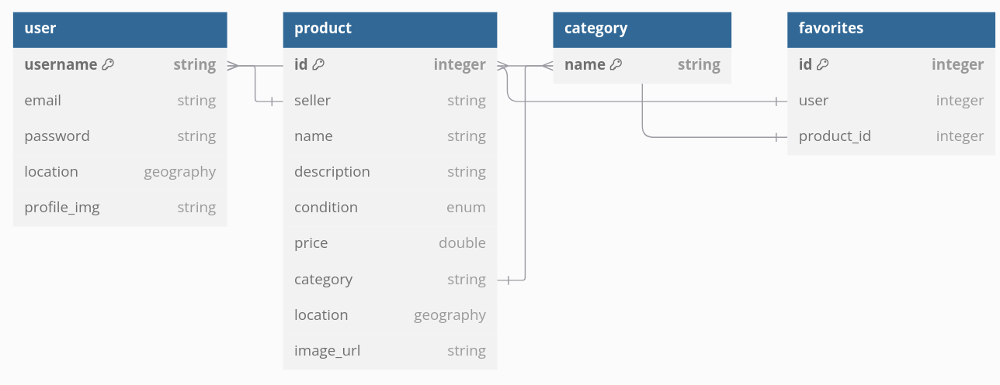

  

<h1 align="center">
 Web Dev Project: Swapzy
</h1>

Web Development & Deployment Proyect, 3rd Year Computer Science International, TUD (Technological University Dublin).

## Introduction

**Swapzy** is a web-based application designed to offer second-hand products for sale. The platform allows users to create accounts, upload products and search for products using filters.

## Features

- **User Authentication**: Secure login and password storage using encryption methods.

- **Product Listings**: Users can upload items with images from the web, descriptions, pricing and location.

- **Search and Filters**: Search and filtering options to find items quickly.

- **Responsive Design**: Optimized for mobile and desktop devices.

- **Text Sanitization**: Input fields are sanitized using DOMPurify to prevent XSS attacks.

## Application Overview

Swapzy enables users to browse and upload products for sale. Each user has access to their own dashboard to manage their listings, and all items are publicly visible for browsing. The app provides easy navigation, an intuitive interface, and secure authentication.

## Implementation Details

### 1. Technologies Used

- **Frontend**: HTML, CSS, Javascript.

- **Backend**: Node.js with Express.js.

- **Database**: PostgreSQL with Sequelize.

- **Password Security**: bycrypt encryption for password hashing.

- **Text Sanitization**: DOMPurify for cleaning user-generated input.

### 2. Folder Structure
The project is organized as follows:
~~~
swapzy/
├── controller/      # Application logic for handling requests
├── routes/          # API routes
├── middleware/      # Middleware
├── sequelize/ 
|   ├── config/      # Database configuration  
|   ├── data/        # Database table default data
|   ├── migrations/  # Sequelize migrations
|   ├── models/      # Sequelize models for database entities
├── view/            # Frontend files (HTML, CSS, JS)
├── utils/           # Utility files
└── app.js           # Entry point for the application
~~~

## Database Design

## How to Run the Application

### Prerequisites
- Node.js installed

- PostgreSQL installed and running

- Database initialized with [dump file](swapzy_db_dump.sql)

- ``.env`` file configured with database credentials

### Steps

1. Clone the repository:

    ~~~ bash
    git clone git@github.com:Eleee28/Web-Project.git

    cd swapzy
    ~~~

2. Install dependencies:

    ~~~ bash
    npm install
    ~~~

3. Set up the database:

    - Create a PostgreSQL database.

    - Configure ``.env`` with the database connection details.

4. Run the app:

    ~~~ bash
    npm start
    ~~~

5. Open the app in your browser at ``http://localhost:8080``

## Credits

This was developed by two students at TUD:

**** **&nbsp;&nbsp;Elena Juarros González**

**** **&nbsp;&nbsp;Isabel Alfageme Rey**
