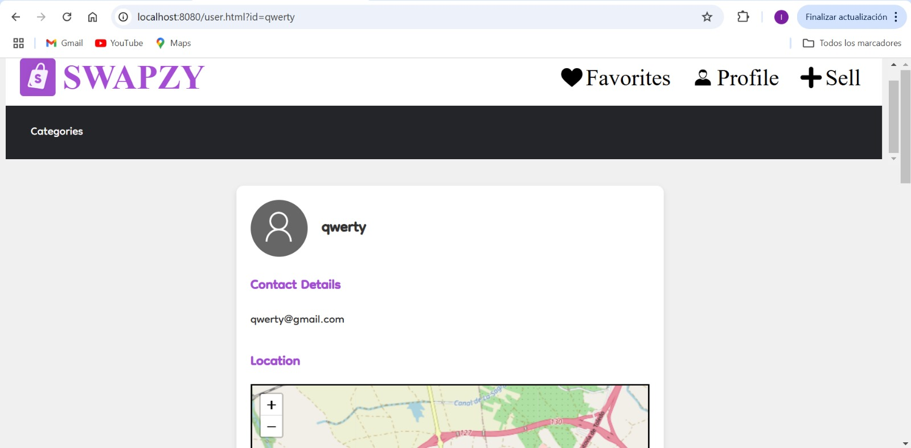

# General Information to Consider

Ignoring for upload on github node_modules/ and .env. Make sure the dependencies and environment variables are locally.

## Insert HTML into HTML

We tried inserting html files into html files using this: ``<iframe src="hello.html"></iframe>``. The issue with doing this is that javascript and some css was not loaded correctly so we had to leave it as we had it.

This is how it looked:
