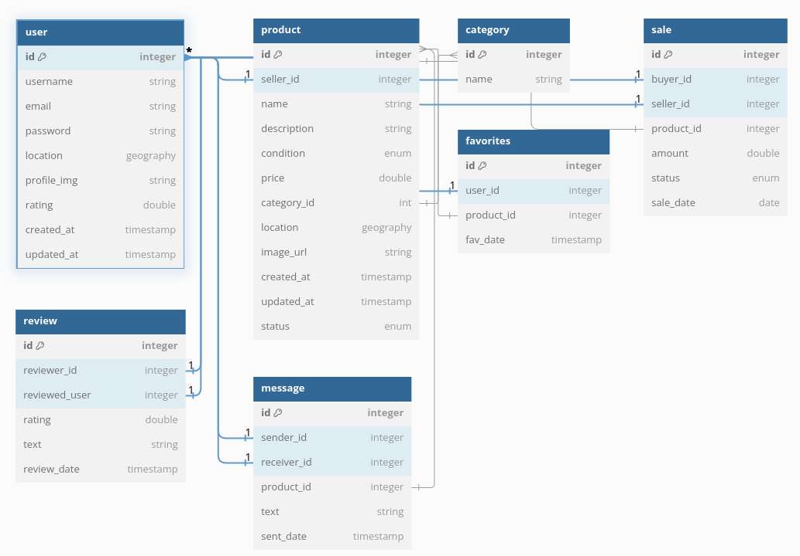

# Database Setup Notes

[Sequelize](https://sequelize.org/)

[Sequelize Querying](https://sequelize.org/docs/v6/core-concepts/model-querying-basics/)

[Getting Started video](https://www.youtube.com/watch?v=p-yKR7GusqM)

## Setup

1. First initialize sequelize in the project to crate the needed directories: ``npx sequelize-cli init``.

2. Change sequelize configuration to add db info.

**Index.js**
sslmode -> check if we want to add TLS to provide with an encripted link between server and client.

**Config.js**
Research on ssl options and implementation, code commented.

## Important changes for improving sequelize files after first test ``database.js``

- Use a shared config file between ``database.js`` and ``config.js``, for having the logic for configuring database connection.
- This file will be imported to both files.

## Create a model

~~~ bash
npx sequelize-cli model:generate --name User --attributes email:string,passwd:string
~~~

Then modify the model file to change attributes (unique, primary keys, ...).

**Associate** is where all the foreing key associations would go.

**Comments** can be added using 'comment:' to an attribute. This comment will be added to the table definition in SQL.

## DataTypes

[Sequelize datatypes](https://sequelize.org/docs/v7/models/data-types/)

[PostGIS install and cheatsheets](https://www.postgis.net/)

To be able to use GEOGRAPHY data type, must install and enable PostGIS on PostgreSQL:

- [Install](https://docs.vultr.com/how-to-install-the-postgis-extension-for-postgresql) 

- Enable: ``create extension postgis;``

**Geography DataType**

- [Sequelize man](https://sequelize.org/api/v6/class/src/data-types.js~geography)

- [Sequelize org (functions man)](https://sequelize.org/api/v7/classes/_sequelize_core.index._internal_.geography)

**Decimal DataType**

``DECIMAL(3, 2)`` 

3 is the precision (how many digits)
2 is the scale (how many digits to the right of the decimal point)

## Associations and Foreign Keys

[Associations Manual](https://sequelize.org/docs/v6/core-concepts/assocs/)

[Video](https://www.youtube.com/watch?v=NXeDkp9BZAY&list=PLp8YCP6EV3eLGyNdFyZ5uGfAjRN0KjwTv&index=3)

Associoations must be defined in both models.
Define the attributes as usual but add references attribute inside the fk.
Then define the aasociations in the associations function.

### Migrations
Migrations can be thought as commits or log for some change in database.

They have an up and a down function. The **up** function is executed when we run the migration. The **down** function is executed when we undo the migration.

~~~ bash
# Run migration
npx sequelize-cli db:migrate

# Undo migration
npx sequelize-cli db:migrate:undo
~~~

## Database structure

~~~ DBML
Table user {
  id integer [primary key]
  username string
  email string
  password string
  location geography
  profile_img string // image url
  rating double // optional feature
  created_at timestamp
  updated_at timestamp
}

Table product {
  id integer [primary key]
  seller_id integer // foreign key
  name string
  description string // maybe more chars (text)
  condition enum // 'new', 'like new', ...
  price double
  category_id int // foreign key
  location geography
  image_url string
  created_at timestamp
  updated_at timestamp
  status enum // 'available', 'sold', 'reserved'
}

Table category {
  id integer [primary key]
  name string
}

Table sale {
  id integer [primary key]
  buyer_id integer // fk
  seller_id integer // fk
  product_id integer // fk
  amount double
  status enum // 'pending', 'completed', 'cancelled'
  sale_date date
}

// optional
Table review {
  id integer [primary key]
  reviewer_id integer // fk
  reviewed_user integer // fk
  rating double
  text string // maybe longer
  review_date timestamp
}

Table message {
  id integer [primary key]
  sender_id integer // fk
  receiver_id integer // fk
  product_id integer // fk
  text string
  sent_date timestamp
}

Table favorites {
  id integer [primary key]
  user_id integer // fk
  product_id integer // fk
  fav_date timestamp // maybe delete
}

Ref: product.seller_id < user.id

Ref: product.category_id < category.id

Ref: sale.buyer_id < user.id

Ref: sale.seller_id < user.id

Ref: sale.product_id - product.id

Ref: review.reviewer_id < user.id

Ref: review.reviewed_user < user.id

Ref: message.sender_id < user.id

Ref: message.receiver_id < user.id

Ref: message.product_id < product.id

Ref: favorites.user_id < user.id

Ref: favorites.product_id < product.id

~~~